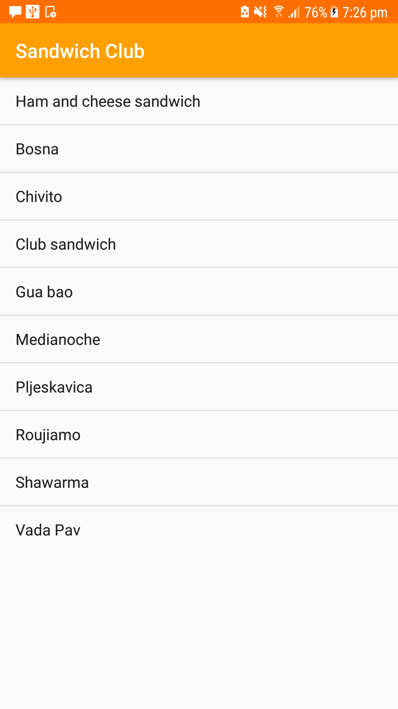
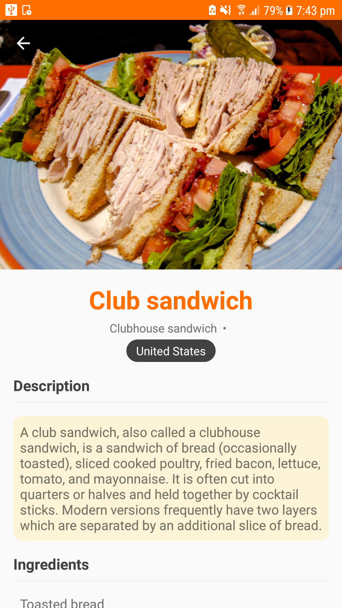
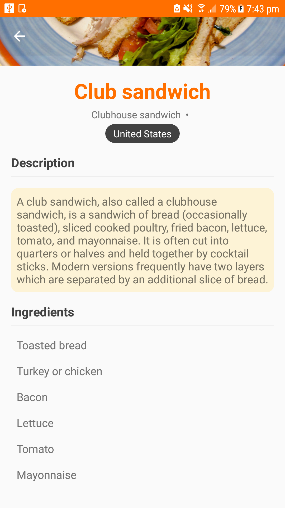
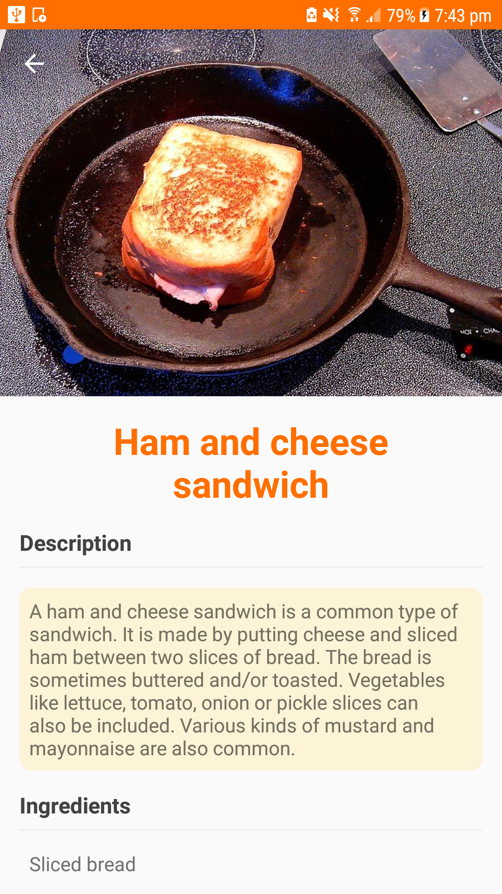

# Sandwich Club App
**Sandwich Club** app written for Udacity Android Developer Nanodegree Program

## Table of Contents
* [Project Background](#project-background)
* [Requirements](#requirements)
* [Project Display Screenshot](#project-display-screenshot)
* [Bugs and Feature Requests](#bugs-and-feature-requests)
* [Resources Used](#resources-used)
* [Skill Demonstrated](#skill-demonstrated)

## Project Background
 The app shows the details of each sandwich once it is selected. This project displays the skill of building a layout and populating its fields from data received as JSON

## Requirements

- Android Studio 3.0.1
- Build Tools Version 26.0.3
- Minimum Android Version: 16 (Android 4.1)

## Project Display Screenshot
Home Screen

    

Detail screens

    
    
    

## Bugs and Feature Requests
If there is a bug or feature request, please open an [issue](https://github.com/eileenwong9305/Sandwich-Club-App/issues/new).

## Resources Used
### Starter code:
Download the [Sandwich Club app starter code.](https://github.com/udacity/sandwich-club-starter-code)

## Skill Demonstrated
- Practice JSON parsing to a model object
- Design an activity layout
- Populate all fields in the layout accordingly
